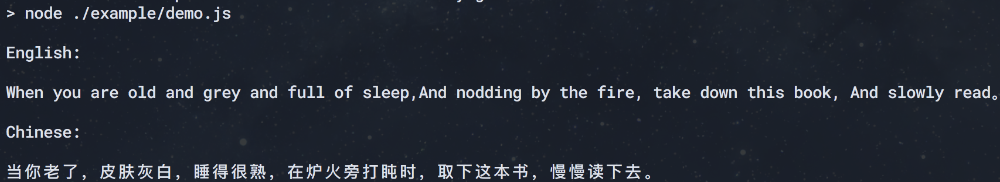

# en2ch

Use baidu fanyi api, to archieve English text to Chinese text translation. Thanks baidu fanyi~

[ ](https://travis-ci.org/X-Jray/en2ch.svg?branch=master)
[](https://opensource.org/licenses/MIT)

## Prepare

```
npm i en2ch --save
```

## Use


```
const en2ch = require('en2ch');

en2ch('hello world').then(ret => {
    console.log(ret); // "你好世界"
}).catch(err => {
    console.log(err.message);
});
```

## Example

```
npm run example
```



## Test

```
npm run test
npm run test-cov
```

